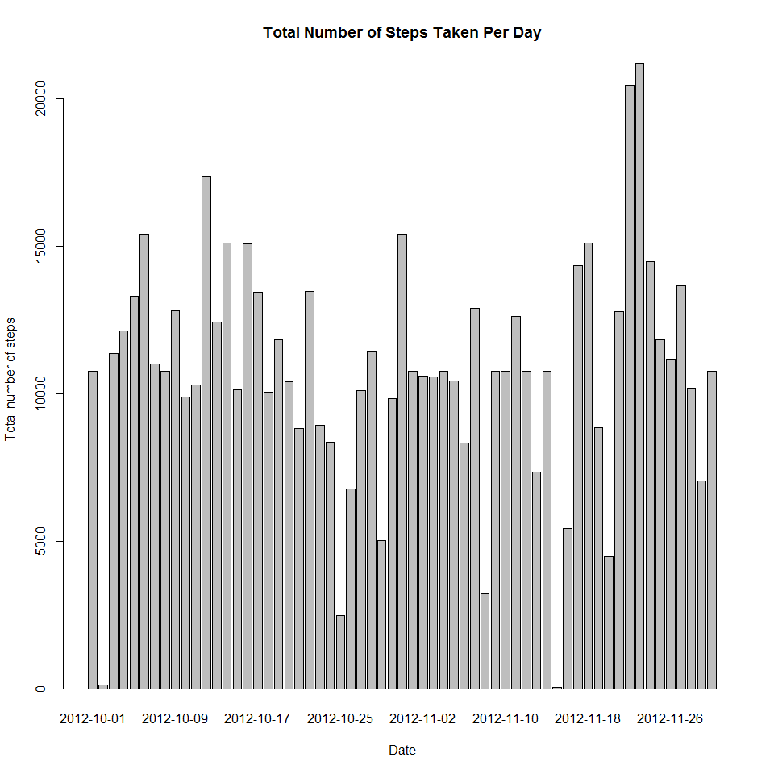
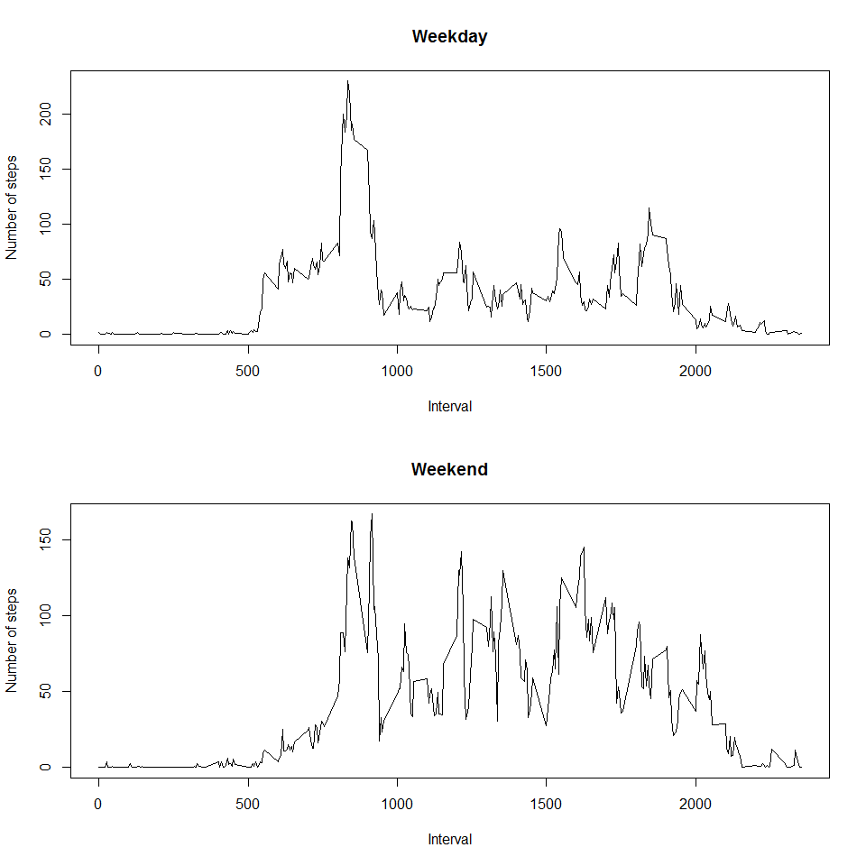

# Reproducible Research: Peer Assessment 1


```r
## Loading and preprocessing the data
unzip("activity.zip")
activity <- read.csv("activity.csv")

## What is mean total number of steps taken per day?

### 1. Calculate the total number of steps taken per day

totalSteps <- aggregate(steps ~ date, data = activity, sum, na.rm=TRUE)
colnames(totalSteps)[2] <- "totalsteps"

### 2. Make a histogram of the total number of steps taken each day

barplot(totalSteps$totalsteps, axis.lty = 1, names.arg = totalSteps$date, 
        xlab = "Date", ylab = "Total number of steps", 
        main = "Total Number of Steps Taken Per Day")
```

 

```r
### 3. Calculate and report the mean and median of the total number of steps taken per day

meanStepsperDay <- mean(totalSteps$totalsteps)

medStepsperDay<- median(totalSteps$totalsteps)

meanStepsperDay
```

```
## [1] 10766.19
```

```r
medStepsperDay
```

```
## [1] 10765
```

```r
## What is the average daily activity pattern?

### 1. Make a time series plot (i.e. type = "l") of the 5-minute interval (x-axis) and the average number of steps taken, averaged across all days (y-axis)

meansteps <- sapply(split(activity,activity$interval),function(x) mean(x$steps, na.rm = TRUE))

xaxis <- as.numeric(labels(meansteps)) 


plot(xaxis,meansteps, type = "l", xlab = "Interval", ylab = "Number of steps", main ="Average number of Steps")
```

 

```r
### 2. Which 5-minute interval, on average across all the days in the dataset, contains the maximum number of steps?

max_interval <- labels(which.max(meansteps))

max_interval
```

```
## [1] "835"
```

```r
## Imputing missing values

### 3. Calculate and report the total number of missing values in the dataset (i.e. the total number of rows with NAs)

missing <- sum(is.na(activity))

missing
```

```
## [1] 2304
```

```r
### 4. Devise a strategy for filling in all of the missing values in the dataset. The strategy does not need to be sophisticated. For example, you could use the mean/median for that day, or the mean for that 5-minute interval, etc.

### Answer: The strategy is to replace the NA value by the mean value for that 5-minute interval

s <- split(activity,activity$date)

stepsclean <- c()

for (i in 1:length(s)){

  stepsday <- s[[i]]$steps

    for (j in 1:length(stepsday)){
    
      if (is.na(stepsday[j])){ 
      
        stepsday[j] <- meansteps[j]
    }

  }

  stepsclean <- cbind(c(stepsclean,stepsday))
  
}

### 5. Create a new dataset that is equal to the original dataset but with the missing data filled in.

dataclean <- activity

dataclean$steps <- stepsclean

head(dataclean)
```

```
##       steps       date interval
## 1 1.7169811 2012-10-01        0
## 2 0.3396226 2012-10-01        5
## 3 0.1320755 2012-10-01       10
## 4 0.1509434 2012-10-01       15
## 5 0.0754717 2012-10-01       20
## 6 2.0943396 2012-10-01       25
```

```r
### 6. Make a histogram of the total number of steps taken each day and  Do these values differ from the estimates from the first part of the assignment? 

steps <- dataclean$steps 

sumstepsdc <- sapply(split(dataclean,dataclean$date),function(x) sum(x$steps)) 

barplot(sumstepsdc, xlab = "Date", ylab = "Total number of steps", main = "Total Number of Steps Taken Per Day") 
```

 

```r
### 7. Calculate and report the mean and median total number of steps taken per day. What is the impact of imputing missing data on the estimates of the total daily number of steps?

meanStepsperDayDC <- mean(sumstepsdc) 

medStepsperDayDC <- median(sumstepsdc) 

meanStepsperDayDC 
```

```
## [1] 10766.19
```

```r
medStepsperDayDC 
```

```
## [1] 10766.19
```

```r
### Answer: Mean and median values do not differ after imputing missing data. 


## Are there differences in activity patterns between weekdays and weekends?

dates <- dataclean$date 

dates <- as.Date(as.character(dates),"%Y-%m-%d") 

days <- weekdays(dates) 

days_factor <- c() 


weekend <- c("Saturday","Sunday") 

for (i in 1:length(days)){ 

  if (days[i] %in% weekend) {
  
    days_factor[i] <- "weekend"
    
    }
    
  else {days_factor[i] <- "weekday"} 
  
} 

dataclean$days_factor <- days_factor


### 1. Make a panel plot containing a time series plot (i.e. type = "l") of the 5-minute interval (x-axis) and the average number of steps taken, averaged across all weekday days or weekend days (y-axis).

dataweekday <- dataclean[dataclean$days_factor=="weekday",]

meansteps_weekday <- sapply(split(dataweekday,dataweekday$interval),function(x) mean(x$steps, na.rm = TRUE))

xaxis_weekday <- as.numeric(labels(meansteps_weekday))

dataweekend <- dataclean[dataclean$days_factor=="weekend",]

meansteps_weekend <- sapply(split(dataweekend,dataweekend$interval),function(x) mean(x$steps, na.rm = TRUE))

xaxis_weekend <- as.numeric(labels(meansteps_weekend))

par(mfrow=c(2,1))

plot(xaxis_weekday,meansteps_weekday,main = "Weekday" ,type = "l", xlab = "Interval", ylab = "Number of steps")

plot(xaxis_weekend,meansteps_weekend,main = "Weekend" ,type = "l", xlab = "Interval", ylab = "Number of steps")
```

 
